# Segurança da Informação e de Redes

## Conteúdo
- [Conceitos Básicos](#conceitos-básicos)
- [Criptografia Simétrica](criptografia-simétrica)
- [Hash e MAC]()
- [Criptografia Autenticada]()
- [Derivação de Chaves]()

## **Conceitos Básicos**
#### Propriedade de Segurança de Informação
- **Confidencialidade**: somente usuário confiáveis podem ter acesso à informação.
- **Integridade**: garantir que a informação não sofreu alterações.
- **Disponibilidade**: garantir que os usuários legítimos tenham acesso à informação.
- **Accountability**: saber quem são os responsáveis pela transação e  ter subsídios para provar que foi feita uma transação (data, hora, origem, destino)

#### Exemplo
- Confidencialidade: ninguém descobre os segredos de Alice
- Integridade: ninguém corrompe as informações de Alice
- Disponibilidade: os sistemas que Alice usa estão sempre disponíveis

#### Ataques à Segurança
- **Ameaças** – circunstâncias, condições ou eventos que forneçam algum potencial de violação de segurança.
- **Vulnerabilidade** – falha ou característica indevida que pode ser explorada para concretizar uma ameaça.
- **Ataque** – conjunto de ações conduzidas por uma entidade não autorizada visando violações de segurança

#### Tipos de ataque (Ativo/Passivo)
- Ataque Passivo: O atacante intercepta um canal de comunicação e mantem registros disso de forma passiva, ou seja, sem interferir na comunicação. Um atacante pode fazer um sniffing do tráfego derede usando um analisador de protocolo ou algum outro software de captura de pacotes.

- Ataque Ativo: o uso de informações obtidas durante um ataque passivo fazem com que o atacante consiga interferir nas comunicações. Exemplos de ataques ativos: crackers de senhas , ataques de negação de serviço.

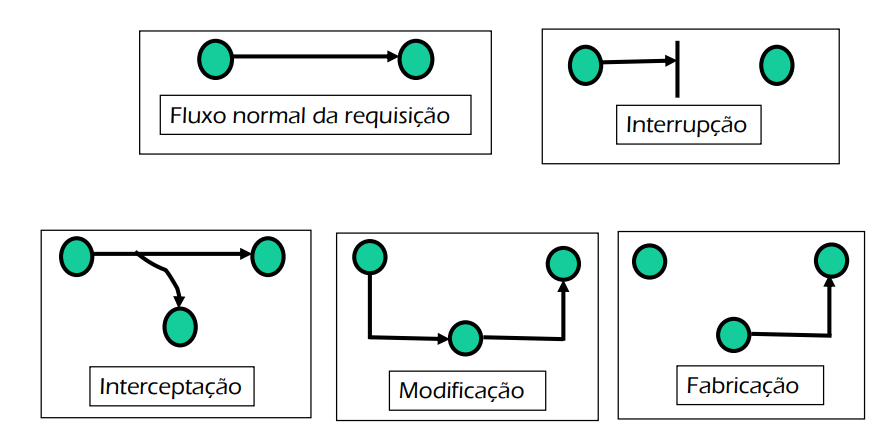

 
 

#### Nomes de Ataques
- Intromissão (Eavesdropping) 
- Mascaramento (Masquerading) 
- Alteração da Mensagem (Message tampering) 
- Ataque do homem do meio (man in the middle) 
- Ataque de Mensagem Antiga (Replaying) 
- Negação de Serviço (Denial of service) 
- Cavalos de tróia (trojan horse), virus, worms 

#### Estratégias de defesa
- Política de Segurança – definição e implementação 
- Plano de Continuidade do Negócio 

#### Serviços de segurança
- Criptografia 
- Autenticação 
- Autorização 
- Auditoria 
- Não-repudiação 
- Firewalls 
- Redes Privadas Virtuais (VPNs) 
- Sistemas de Detecção de Intrusão 

### Exercícios
Quais as três características essenciais de segurança? Cite um exemplo prático de cada característica.
>  
> As propriedades de segurança de informação são as seguintes:
> - Confidencialidade: somente usuários confiáveis tem acesso à informação. 
> Ex: Alice é uma usuária legítima e pode acessar os sistemas.
> - Integridade: é a garantia que as informações não sofreram alterações. Ex: ninguém corrompe as informações de Alice. 
> - Disponibilidade: é a garantia que usuários legítimos sempre teram acesso as informações.Ex: os sistemas que Alice usa estão sempre disponíveis

Cite e explique três tipos importantes de ataques feitos na Internet.
> **Injection:** É um ataque que permite inserir dados não confiáveis enganando o sistema para executar comandos não intencionais. Por exemplo, no campo de inserção de login e senha, o atacante insere um query SQL para obter alguma informação do banco de dados.
>  
> **Broken Authentication:** A autenticação interrompida ocorre quando uma aplicação administra mal as informações relacionadas à sessão, de modo que a identidade do usuário seja comprometida. As informações podem estar na forma de cookies de sessão, senhas, chaves secretas etc.
>  
> **Known Vulnerabilities:** Se quaisquer componentes com vulnerabilidades conhecidas forem usados poralguma aplicação, isso pode levar brechas de segurança. Por exemplo, uma versão do JQuerydesatualizada. fonte: https://www.greycampus.com/blog/information-security/owasp-top-vulnerabilities-in-web-application

O que é uma vulnerabilidade? Conceitue e cite um exemplo.
> São falhas ou features que podem ser exploradas para um possível ataque. 
>  
> Ex: o github emite alertas de vulnerabilidades sobre as dependencias de um projeto que apresentam vulnerabilidades, do tipo uma versão de uma biblioteca desatualizada.
>  
> Ex: utilizando o metasploit, pode ser feito um ataque de dicionário para explorar vulnerabilidades. Owasp utiliza senha e login padrão.

O que é um ataque? Conceitue e cite um exemplo.
> Ataque são ações para violar a segurança. Exploram as vulnerabilidades.

---

## Criptografia Simétrica
É uma técnica de de criptografia baseada em 2 algortimos, encriptador (E) e decriptador (D).

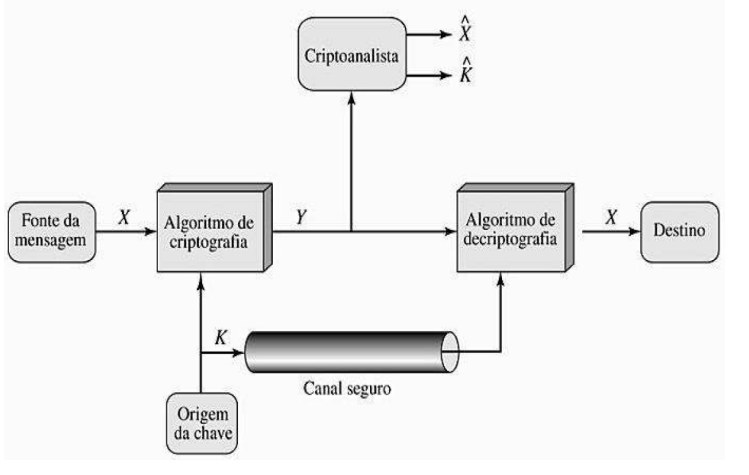

 

- Criptografia: é uma ciência e arte de escrever de modo secreto a informação.
- Cifra: é o algoritmo de cifragem

 

#### Técnicas de Cifragem
- Combinação
- Permutação
- Subtituição

#### Tipos de cifra Simétrica
- Fluxo (RC4)
- Bloco (AES)
  - Modos de operação
    - maneiras de organizar a cifragem

## Bizu 
- [x] Criptografia simétrica --> confidencialidade
- [x] Hash --> integridade
- [x] MAC (hash com chave) --> integridade + autenticidade
- [x] AE --> confidencialidade + integridade + autenticidade
- Se tem **cifragem**, tem confidencialidade
- Se tem **hash com chave**, tem autenticidade

### Exercícios
> **Cite os dois tipos principais de algoritmos criptográficos.**
> Algoritmos simétricos que usam a mesma chave criptográfica e algoritmos assimétricos (chave pública) que usam pares de chaves públicas e podem ser amplamente disseminadas, e chaves privadas que são conhecidas apenas pelo proprietário.

> **Quais são as técnicas de cifragem básicas**
> - Substituição
> - Permutação
> - Combinação

Explique o funcionamento da criptografia simétrica usando a figura 1.
> 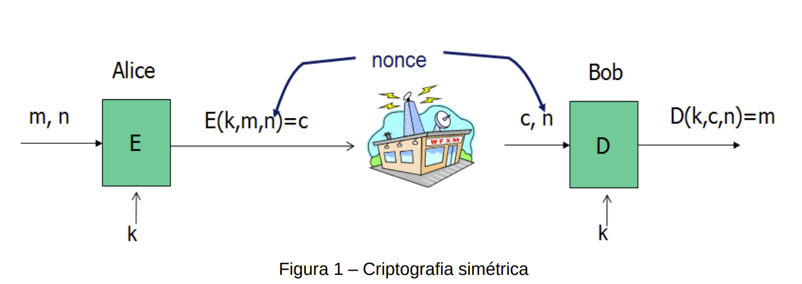
>  
>  

Alice quer enviar uma mensagem **m** para Bob. Para isso ela encripta a mensagem usando uma **cifra** **E**
> - A cifra E tem os seguintes parametros (K, M, N)
>  - K: key, é a chave compartilhada entre Bob e Alice
>  - M: mensagem
>  - N: nonce (IV), é um número aleatório usado junto com a chave para cifrar a mensagem com o objetivo de garantir mais aleatoriedade para a mensagem. O IV deve ser compartilhado entre as partes
>  - C: mensagem cifrada
> Bob utiliza uma cifra para descriptografar a mensagem **c** recebida. Para isso, ele utiliza o IV(nonce) e a chave para descriptografar a mensagem.

Qual a diferença entre chave de uso único e chave de uso múltiplo? Explique e comente.
> Chave de uso único: é usado para cifra uma mensagem. Não precisa de nonce. Ex: email cifrado
>  
> Chave de uso múltiplo: é usado para cifrar múltiplas mensagens.Necessário usar nonce. Ex: SSL

Explique o que é uma cifra de fluxo. Cite nomes de algoritmos deste tipo.
> São geradores de números aleatórios ou pseudo-aleatórios.
>  
> Ex: RC4

Explique o que é uma cifra de bloco. Cite nomes de algoritmos deste tipo.
> Uma cifra de bloco é um algoritmo determinístico que opera sobre agrupamentos de bits de tamanho fixo, chamados de blocos, com uma transformação invariável que é especificada por uma chave simétrica.
>  
> ex: AES

O que são os “modos de operação” das cifras de bloco?
>  Maneiras diferentes de organizar a cifragem de longos textos planos, por exemplo email ou arquivo, com cifras de bloco.

Para garantir a segurança no modo CBC, existe algum LIMITE de mensagens que podem ser cifradas com a mesma chave? Explique e dê exemplo.
> Para este modo de operação existe um limite pois pode haver um ataque ativo de adulteração (tampering). Exemplos de limites:
>  
> AES 128 bits de bloco: depois de 248 blocos AES, DEVE ser trocada a chave
>  
> 3DES 64 bits de bloco: depois de 216 blocos 3DES, DEVE ser trocada a chave 

A chave de um algoritmo de criptografia simétrica tem 3 bits. O IV tem 2 bits. Supondo que essa chave será usada para cifrar 35 mensagens:

a) explique para que serve e como é usado o IV
> O IV serve para que a chave possa ser usada mais de uma vez. É adicionado no final da chave. Neste caso temos (3 bits de chave + 2 bits de IV) no total=2^5 mensagens que podem ser enviadas com segurança.

b) considerando o uso do IV, explique quantas chaves diferentes podem existir
> 2^5

c) será possível cifrar todas as 35 mensagens e garantir a segurança contra ataques ao texto cifrado?
> Não, no máximo 32 mensagens. 

Qual a vantagem e a desvantagem dos sistemas de criptografia simétrica?
> Fornecem APENAS CONFIDENCIALIDADE 
>  
> Problema de distribuição de chaves
>  
> Mais rápidos que os sistemas assimétricos

 
 

---

## Funções Hash e MAC
#### Hash Criptográfico **(INTEGRIDADE)**
- É uma função de transformação que retorna um valor de hash.
- A função hash pode ser apĺicada a qualquer tamanho de bloco
- A saída sempre será um tamanho fixo
- Garante a resistência a colisões. É quase impossível 2 mensagens com o mesmo hash de saída.
- Tipos
  - sem chave: SHA, MD5
  - com chave
- Propriedades
  - Garantem resistência contra "preimage":  sabendo o valor do hash é computacionalmente inviável encontrar a mensagem que deu origem àquele valor (sentido inverso da função é difícil).
  - Garantem resistência contra 'second pre-image": computacionalmente inviável encontrar uma 2ª msg que possui o mesmo valor hash que uma 1ª msg conhecida.
  - Garantem resistência a colisão: muito difícil encontrar duas mensagens que geram o mesmo valor de saída da função hash.

#### Hash Criptográfico: **sem** chave
- O usuário prepara a sua mensagem inserindo no final da mensagem um hash. O usuário que irá receber a mensagem, recebe tambem o calculo de hash. Então ele abre e recalcula o hash para comparar e garantir que não houve quebra de integridade. 
- Pode sofrer ataque de man-in-the-middle

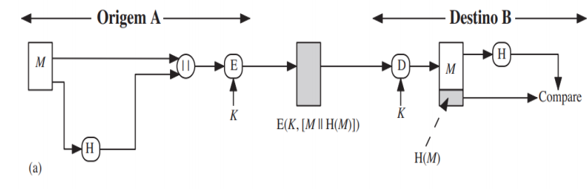
 
 

- oferece **CONFIDENCIALIDADE** na parte `E(K, [M || H(M)])`
- oferece **AUTENTICAÇÃO** na parte `H(M)`
- || é concatenar

 
 

#### Hash Criptográfico: **com** chave **(INTEGRIDADE + AUTENTICIDADE)**
- HMAC
- O hash com chave **fornece INTEGRIDADE e AUTENTICAÇÃO, sem confidencialidade**
- É contruido usando cifras de bloco e funções hash sem chave.
- MAC (Message authentication code) – autenticador de mensagem. Também chamado de MAC ou tag.
- MAC é seguro quando um atacante não consegue produzir um tag válido para uma nova msg

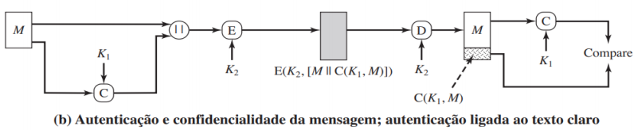

- oferece **CONFIDENCIALIDADE** na parte que compartilham a `K1`
- oferece **AUTENTICAÇÃO** na parte `E(K2, [M || C(K, M)])`

 

### Exercícios
Quais as propriedades das funções hash criptográficas?
>- Garantem resistência contra "preimage":  sabendo o valor do hash é computacionalmente inviável encontrar a mensagem que deu origem àquele valor (sentido inverso da função é difícil).
>  
>- Garantem resistência contra 'second pre-image": computacionalmente inviável encontrar uma 2ª msg que possui o mesmo valor hash que uma 1ª msg conhecida.
>- Garantem resistência a colisão: muito difícil encontrar duas mensagens que geram o mesmo valor de saída da função hash.

> **Explique o conceito de hash sem chave.**
> O conceito e funcionamento é o seguinte: o usuário prepara a sua mensagem inserindo no final da mensagem um hash. O usuário que irá receber a mensagem, recebe também o cálculo de hash, valor do HMAC. Então ele abre e recalcula o hash para comparar e garantir que não houve quebra de integridade.

Explique o conceito de hash com chave. Por que o hash com chave fornece integridade e autenticidade?
>- Por que fornece integridade: por conter um cálculo no emissor que pode ser recalculado no receptor para verificar a modificação do conteúdo.
>  
>- Por que fornece autenticidade: por usar uma chave compartilhada por ambos no cálculo feito, assim, quem recebe a msg tem certeza de quem fez o cálculo no emissor, já que somente as duas partes compartilham a chave.

Explique em detalhes o funcionamento representado na figura 3. A figura 3(a) é igual à figura 3(b). Na figura 3(a), o cálculo do MAC é chamado de TAG. Na figura 3(b), o cálculo do MAC é chamado de C e é calculado assim: MAC = C(K, M). A figura 3(b) está no livro do Stallings. O MAC pode ser chamado de: mac, hash com chave, código de autenticação de mensagem e tag.
> 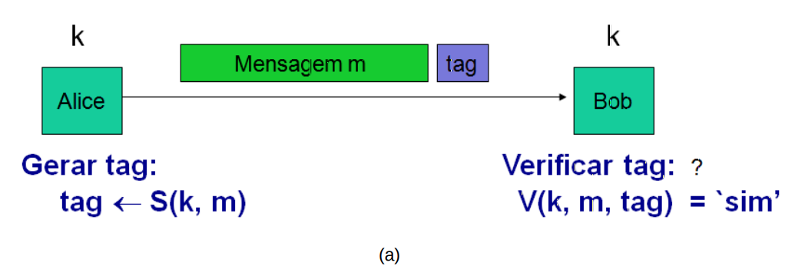
> 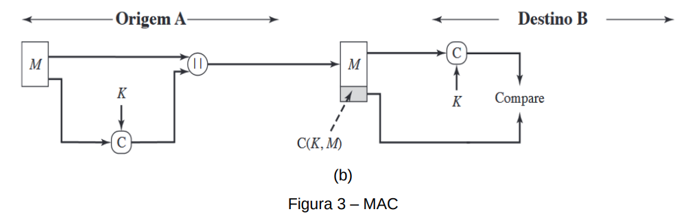
>  
>  
> A mensagem sai da origem A. No ponto || acontece a concatenção da mensagem (m) com a autenticação de mensagem (C) usando uma chave (K). A mensagem chega no destino B onde é autenticação de mensgem (C) é aberta usando uma chave (K). A partir disso é correto dizer que  é oferecido autenticação pois somente A e B comparttilham a chave K.

Cite nomes de algoritmos de hash sem chave e com chave considerados importantes.
> Sem chave: Família SHA, MD5
>  
>  Com chave: CMAC e CBC-MAC, HMAC

Considerando que um código Java de um programa envia pela rede a mensagem e o SHA-256 da mensagem, conforme representado na figura 4, responda:
>  
> 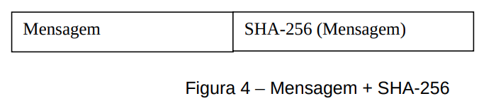

 

a) É possível que um atacante consiga modificar ambos: a mensagem e o SHA-256 da mensagem? O
receptor irá identificar a modificação? Explique.
> Sobre o SHA-256 e a mensagem: é possível pois SHA-256 é hash sem chave, alem disso, o atacante poderá, com esforço computacional,encontrar o hash da mensagem. Então seria possível alterar ambos sem a vítima detectar a alteração. 

 
 

b) Se o item a é possível, explique como impedir essa situação
> Um algoritmo de hash com chave resolveria esssa situação, pois neste caso o atacante precisaria ter a chave secreta usada para calcular o hash. Esta chave secreta só estaria de posse dos envolvidos nesta troca de mensagem.

De acordo com o link https://crackstation.net/hashing-security.htm, comente o que é certo e o que é errado quando se usa hashes (com salt) para guardar senhas.
>- É certo usar salt aleatório e com comprimento adequado
>  
>- Usar o mesmo salt apenas uma vez
>  
>- Usar algortimos de criptografia já existentes e aprovados pela comunidade

Considerando que Alice quer enviar a mensagem para Bob, faça:

 

a)Desenhe como é gerado o MAC de uma mensagem no lado da Alice.
> 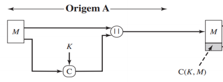

 
 

b) Desenhe como é verificado este MAC no lado de Bob
> 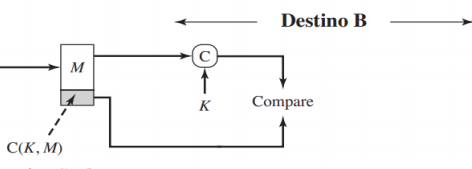

 
 

c) Explique como e quais características são garantidas pelo MAC (CID)
>  
>- integridade: por conter um cálculo no emissor que pode ser recalculado no receptor para verificar a modificação do conteúdo.
>  
>- autenticidade: por usar uma chave compartilhada por ambos no cálculo feito, assim, quem recebe a msg tem certeza de quem fez o cálculo no emissor, já que somente as duas partes compartilham a chave.

 
 

Desenhe usando criptografia simétrica, hash e/ou MAC combinados (não é obrigatório o uso de todos) de forma que os seguintes objetivos sejam atendidos na comunicação de mensgens entre Alice e Bob.
 

a) Autenticação de mensagem enviada de Alice para Bob.
> 
 
> Fornece autenticidade pois ambos compatilham a chave secreta, então quando Bob utilizar a chave para recalcular o MAC saberá que foi de Alice.

 
 

b) Integridade e confidencialidade de mensagem enviada de Alice para Bob.
> 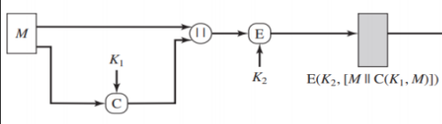
>  
> Fornece integridade pois o receptor poderá recalcular o MAC para verificar se a mensagem foi alterada. 
> Fornece confidencialidade pois a mensagem tambem foi criptografada junto com o MAC.

 
 

c) Confidencialidade, integridade e autenticidade da mensagem enviada de Alice para Bob. Explique as tarefas de emissão e as tarefas de recepção.
> 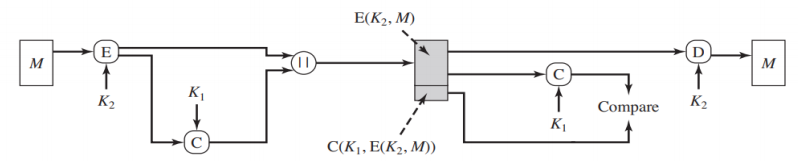
>  
> Alice quer enviar uma mensagem para Bob (A -> B). 
 
> Primeiramente a mensagem é cifrada (E) usando uma chave simétrica (K1) (A -> B: E(K1, M)). Nessa etapa é garantido a confidencialidade pois só os envolvidos na comunicação é que sabem a chave. É neste momento que é gerado um texto cifrado. O texto cifrado é inserido como entrada no cálculo de MAC junto com a chave (K2). Neste momento a integridade e autenticidade são garantidos pois se a mensagem for alterada, poderá ser notado através da comparação das tags. A tag (T1) gerada é concatenada com o texto cifrado. O resultado deste processo é enviado para Bob.
 
> Bob decifra o texto utilizando a chave K2 em (D). Para validar a integridade dessa mensagem é feito um recálculo do MAC sobre a mensagem recebida utilizando a chave (K1) e em seguida é comparado os valores para ver se não houve alterações. 

---

## Criptografia Autenticada
> O que é criptografia autenticada (authenticaded encryption)?
> É a combinação da criptografia simétrica e MAC.

Como é que a criptografia autenticada consegue garantir a confidencialidade, a integridade e a autenticidade? Explique
> O objetivo da AE é: garantir confidencialidade, INTEGRIDADE e autenticidade (da origem dos dados). Isto pode ser alcançado combinando criptografia simétrica com MAC.

Quais os modos de criptografia autenticada? Represente cada um dos modos com uma figura
> Encrypt-and-Mac (E&M):
>  
> 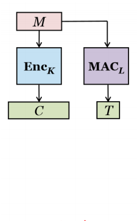
> 
> Mac-then-Encrypt (MtE):
>  
> 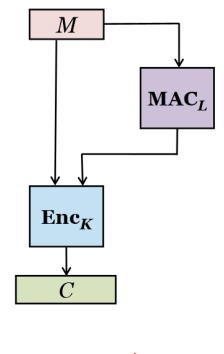
>  
> Encrypt-then-Mac (EtM):
>  
> 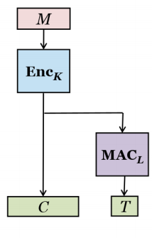
 

> Quais os padrões de criptografia autenticada? Quais os padrões que a biblioteca Bouncy Castle implementa?
> Os padrões (modos) da criptografia autenticada são MAC-then-encrypt, encrypt-then-MAC, encrypt-and-MAC. São as formas de organizar a "combinação entre MAC e criptografia simétrica".
>  
> Boyce-Castle implementa:
>  
> - CCM (AEAD)
> - EAX (AEAD) 
> - GCM (AEAD)
> - OCB (AEAD)

---

## Derivação de Chave
O que é uma função KDF?
> Key Derivation Function (KDF) é uma função de derivação de chave.

Como funciona o PBKDF2? Quais os parâmetros necessários para o seu funcionamento?
> É uma função de derivação de chave. O seu funcionamento é fazer a derivação de senha de usuário. Os parâmetros são: salt, password, número de iterações (número de vezes que a função PRF é executada). 

Usando a notação descrita abaixo, suponha que A quer enviar uma mensagem M para B. As partes A e B compartilham uma chave simétrica K. Faça:

 

a) Responda SIM ou NÃO em cada quadrado em branco; Se respondeu SIM em alguma opção você deve justificar COMO essa opção é oferecida.

> 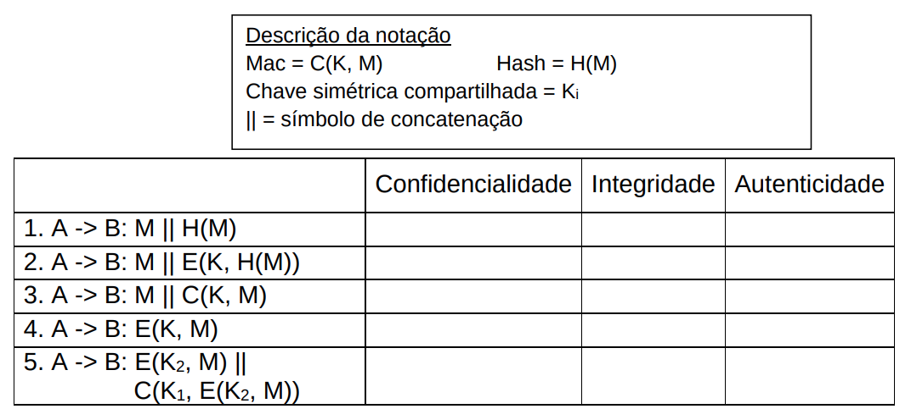
>  
> 1. Integridade: pq tem hash e este hash é recalculado pelo receptor.
>  
> NOTA:Não tem chave, logo não tem autenticidade.
>  
> 2. Autenticidade: somente A e B compartilham a K.Integridade: pq tem hash e este hash é recalculado pelo receptor.
>  
> NOTA: O que esta sendo cifrado é o Hash, logo a mensagem esta em claro.
>  
> 3. Integridade: pq tem hash e este hash é recalculado pelo receptor. Autenticidade. somente A e B compartilham a K
>  
> 4. Confidencialidade: a mensagem vai criptografada E(M). Autenticidade: somente A e B compartilham a K.
>  
> 5. Confidencialidade. a mensagem vai criptografada E(M).Integridade: pq tem hash e este hash é recalculado pelo receptor. Autenticidade: somente A e B compartilham a K1.
>  
> NOTA: é criptografia autenticada. Encrypt-then-MAC

### OpenSSL
Alice deseja enviar uma mensagem para Bob. Alice deseja que Bob tenha certeza que a mensagem não foi modificada enquanto estava trafegando pela rede. Para isso, Alice irá usar o openssl para construir o pacote a ser enviado para Bob. Bob também irá usar o openssl para verificar a mensagem recebida de Alice.

 

Construa os comandos que Alice e Bob devem usar.
 
Sua resposta deve conter:
 
a) comando(s) openssl de Alice
> openssl dgst -sha256 -mac HMAC -macopt hexkey:aabbcc t1.txt 

 
 

b) explicação do(s) comando(s) openss de Alice
> Alice quer garantir a integridade da mensagem, então para isso é necessário usar hash com chave (HMAC). O comando calcula o MAC do arquivo t1.txt usando a chave aabbcc.

 
 

c) cite o que Alice envia para Bob
> Supondo que Alice e Bob já tenham compartilhado a chave, Alice precisa enviar o arquivo e o calculo (valor do HMAC) que é a saida deste comando

 
 

d) cite o que Bob recebe de Alice
> Bob recebe o arquivo t1.txt e o valor do HMAC para recalcular o HMAC e assim conseguir conferir se esta igual.

 
 

e) comando(s) openssl de Bob
> openssl dgst -sha256 -mac HMAC -macopt hexkey:aabbcc t1.txt 

 
 

f) explicação do(s) comando(s) openssl de Bob.
> Bob precisa executar o mesmo comando que Alice executou e conferir se a saída, valor de HMAC, é o mesmo que Alice havia lhe enviado. 

---

### Criptografia Assimétrica

1. Explique o funcionamento da criptografia assimétrica. 
> Uma chave “tranca” e outra chave “libera” qualquer coisa enviada pelo seu par ( “assimétrica”). Um chave é mantida em segredo (privada) e outra torna-se pública então para isso é necessário um “guardador” confiável da chave pública.
> O passo a passo é:
>  
> Passo 1: receptor guarda chave pública com autoridade pública confiável e mantém em segredo a chave privada
>  
> Passo 2: para enviar a msg, o emissor procura a chave pública do receptor e usa esta chave para cifrar a msg
>  
> Passo 3: o receptor (e apenas ele) pode usar a chave privada que decifra aquela msg

2. Dê exemplos de algoritmos assimétricos.
> RSA, Elliptic Curve, Algoritmos de Assinatura: RSA-PSS (PKCS#1, ISO/IEC 9796-2), DSA (FIPS PUB 186-3, ISO/IEC 14888-3), ECDSA

3. Quais as vantagens e desvantagens dos algoritmos assimétricos?
> Vantagens: chaves públicas amplamente distribuídas, provê assinatura digital
> Desvantagens: vagaroso, distribuição de chaves

### Certificado Digital

8. Explique o que é um certificado digital.
> É uma estrutura de dados que é gerada e assinada por uma entidade confiável, garantindo a autenticidade dos dados.

9. O que é assinatura digital?
> Assinar significa usar a chave privada (que é segredo e o dono não revela a ninguém) para cifrar uma msg. Assinatura digital é uma maneira segura de assinar  documentos que precisam transitar em meio eletrônico. 

11.Para que serve a assinatura que existe no certificado digital? Explique detalhadamente como é feita essa assinatura.
> Toda assinatura digital está associada a um certificado digital e é por meio dele que os dados do usuário ficarão protegidos e sem risco de serem violados.

12.Explique detalhadamente como é verificada a assinatura de um certificado digital.
> Por exemplo, será enviado um arquivo de texto de modo seguro. Alice, que vai enviar o arquivo, publica a chave pública para verificação de assinaturas. O arquivo é cifrado, depois executado uma função hash, este hash do documento é inserido no algoritmo criptográfico assimétrico juntamente com a chave privada de Alice, como retorno é recebido a assinatura digital.

14.Como um criptosistema de chave pública resolve o problema do gerenciamento de chaves?
> Criptosistemas de chave pública resolvem o problema da distribuição da chave secreta (desde que um canal seguro para comunicação de chaves públicas possa ser implementado) sendo que cada entidade tem um PAR de chaves: pública e privada
 
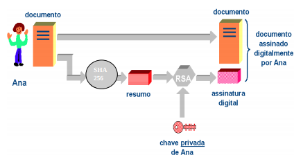
 

---

### Bizus
- [Cheat sheet](https://github.com/OWASP/CheatSheetSeries/blob/master/cheatsheets/Password_Storage_Cheat_Sheet.md)

---

#### Autor

Bruno Aurélio Rôzza de Moura Campos 

---

#### Copyright
 
