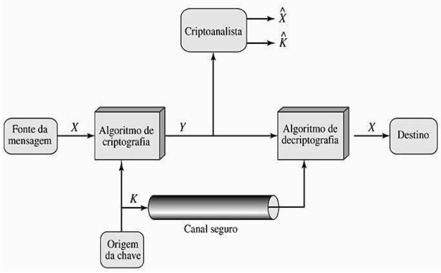

**Disciplina:** INE 5680–Segurança da Informação e de Redes  
**Professora:** Carla Merkle Westphall  
**Aluno:** Bruno Aurélio Rôzza de Moura Campos (14104255)  

## Exercícios
Entregar 10 questões da lista respondidas. Você pode escolher as questões.

##### 1.Quais as três características essenciais de segurança? Cite um exemplo prático de cada característica.
- Confidencialidade: somente usuários confiáveis têm acesso às informações privadas. 

- Integridade: a perda de integridade é a modificação ou destruição de informações por alguem não autorizado.

- Disponibilidade: somente usuários confiáveis podem ter acesso disponível às informações.

##### 2.Cite e explique três tipos importantes de ataques feitos na Internet.

- Injection:
É um ataque que permite inserir dados não confiáveis ​​enganando o aplicativo / sistema para executar comandos não intencionais. Por exemplo, no campo de inserção de login e senha o atacante inseri um query SQL para obter alguma informação do banco de dados.

- Broken Authentication:
A autenticação interrompida ocorre quando uma aplicação administra mal as informações relacionadas à sessão, de modo que a identidade do usuário seja comprometida. As informações podem estar na forma de cookies de sessão, senhas, chaves secretas etc.

- Known Vulnerabilities:
Se quaisquer componentes com vulnerabilidades conhecidas forem usados por alguma aplicação, isso pode levar brechas de segurança. Por exemplo, uma versão do JQuery desatualizada.
 
fonte: https://www.greycampus.com/blog/information-security/owasp-top-vulnerabilities-in-web-applications

##### 3.Qual a diferença entre ataque ativo e ataque passivo –cite um exemplo de cada tipo.

- Ataque Passivo:
O atacante intercepta um canal de comunicação e mantem registros disso de forma passiva, ou seja, sem interferir na comunicação. Um atacante pode fazer um sniffing do tráfego de rede usando um analisador de protocolo ou algum outro software de captura de pacotes.

- Ataque Ativo: o uso de informações obtidas durante um ataque passivo fazem com que o atacante consiga interferir nas comunicações. Exemplos de ataques ativos: crackers de senhas , ataques de negação de serviço.

##### 5.O que é uma vulnerabilidade? Conceitue e cite um exemplo.
São falhas ou features que podem ser exploradas para um possível ataque. Por exemplo, o github emite alertas de vulnerabilidades sobre as dependencias de um projeto que apresentam vulnerabilidades, do tipo uma versão de uma biblioteca desatualizada.

##### 11.Cite as três maiores ameaças em aplicações descritas em:https://www.owasp.org/images/0/06/OWASP_Top_10-2017-pt_pt.pdf

- Injeção:
A injeção pode resultar em perda ou corrupção de dados, falha de
responsabilização, ou negação de acesso. A injeção pode, às vezes, levar ao controlo total do sistema.

- Quebra de Autenticação:
Os atacantes apenas têm de ganhar acesso a algumas contas, ou a uma conta de administrador para comprometer o sistema.

- Exposição de Dados Sensíveis:
Essa é uma ameaça à confidencialidade. Ao invés de atacar diretamente a
criptografia, os atacantes tendem a roubar chaves, executar ataques MitM ou roubar dados em claro do servidor, em trânsito ou no cliente

##### 13.Conceitue criptografia.
É uma ciência e arte de escrever de modo secreto e armazenamento secretp de informação.

##### 14.Cite os dois tipos principais de algoritmos criptográficos.
Algoritmos simétricos que usam a mesma chave criptográfica e algoritmos assimétricos (chave pública) que usam pares de chaves públicas, que podem ser amplamente disseminadas, e chaves privadas que são conhecidas apenas pelo proprietário.

##### 16.Quais são as técnicas de cifragem básicas?
- Substituição
- Permutação
- Combinação

##### 18.Como pode ser feita a quebra das cifras de substituição?
Pode ser analisado a frequência de uso de um determinado simbolo e a partir disso inferir algum valor, por exemplo, freqüência de letras em inglês: e (12.7%), t (9.1%), a (8.1%)

##### 19.Quais são as entradas de um algoritmo criptográfico? O que é necessário se ter para usar um algoritmo criptográfico? 
As entradas são uma mensagem e uma chave. Um algoritmo criptográfico é algo que dada uma mensagem e uma chave consiga gerar uma nova mensagem ilegivel e no final seja possível recuperar a mensagem original. A imagem abaixo ilustra esta definição:

