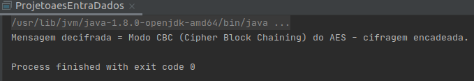
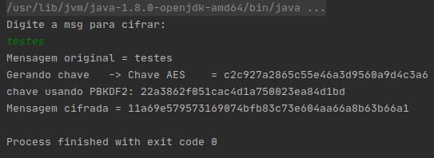

# Tarefa Prática 

### Aluno
- Bruno Aurélio Rôzza de Moura Campos (14104255) 

### Matéria
- Segurança da informação e sistemas - INE5680

## Tarefa Prática – Exercícios de criptografia simétrica, hash, MAC, PBKDF e Criptografia Autenticada em Java

1. **Abra o projeto2CodigoLivro e teste o seu funcionamento. Responda:**
   - **1.1. Qual algoritmo é usado no código? Em qual modo?** 
Algoritmo AES no modo CBC. _Symmetric encryption example with padding and CBC using AES_

   - **1.2. Explique o que faz o método generateKey da classe https://docs.oracle.com/javase/7/docs/api/javax/crypto/KeyGenerator.html** 
Gera uma chave secreta (simétrica).

   - **1.3. Explique como são usados os métodos init, update e doFinal para cifrar e para decifrar os dados nesse código. Leia a documentação e entenda bem o funcionamento desses métodos.**

`init`: é o método que inicia o "Cipher", cifra, recebendo o parâmetro o tipo de operação a cifrar ou decifrar `opmode` alem de a chave de criptografia e o IV.
Fonte: https://docs.oracle.com/javase/7/docs/api/javax/crypto/Cipher.html#init(int,%20java.security.Key,%20java.security.AlgorithmParameters)

`update`: Continua uma operação de encriptação ou descriptação de outras partes (dependendo de como essa cifra foi inicializada), processando outra parte de dados.
Os parâmetros deste método podem ser: um array de bytes que é o input a ser processado, o offset, o tamanho do input, o texto cifrado e o tamanho desse texto cifrado. 
Fonte: https://docs.oracle.com/javase/7/docs/api/javax/crypto/Cipher.html#update(byte[],%20int,%20int)

`doFinal`:
Finaliza a operação de cifragem ou decifragem das múltiplas partes de dados dependendo de como a cifra foi inicializada.
Fonte: https://docs.oracle.com/javase/7/docs/api/javax/crypto/Cipher.html#doFinal(byte[],%20int)

---

2. **Crie um programa que permite ao usuário entrar com uma string pelo teclado, o programa cifra a string e mostra a string cifrada na tela. O código deve “sortear” uma boa chave e IV. Use o modo CTR (counter) do algoritmo AES para cifrar. Use o projeto3Aes para auxiliar.**

- Arquivo: [questao_2.java](https://github.com/brunocampos01/seguranca/blob/master/tarefa_pratica_01/questao_2.java)
- Resultado da execução:

---

3. **Nesse projeto você irá programar dois sistemas de decifragem, um usando o AES em modo CBC e outro usando o AES no modo contador (counter mode – CTR). Em ambos os casos um IV de 16 bytes é escolhido de forma aleatória e está colocado no início do texto cifrado (precede o texto cifrado). Para o modo CBC use o esquema de padding PKCS5. Para o modo CTR use NoPadding.** 
**Inicialmente iremos testar apenas a função de decifragem. Use o projeto3Aes para auxiliar a responder as questões. 
Nas questões seguintes você recebe uma chave AES e um texto cifrado (ambos codificados em hexa) e o seu objetivo é recuperar o texto plano/texto decifrado. A resposta de cada questão é o texto decifrado (frase em português).**

   **3.1**
   - Chave CBC: `53efb4b1157fccdb9902676329debc52`
   - IV: `d161fbaa4c64ecf7d2c4abd885751273`
   - Texto cifrado em modo CBC: `701f7fa45d9bb922c3cb15a519ba40ede1769eb753650886d6e69ebcad9c2816002679896a65a921d25e00793078474e3dbeca9a2838031c490e5ae9d1ea143f`

   **Resposta-texto decifrado:** 
   - _Mensagem decifrada = Modo CBC (Cipher Block Chaining) do AES - cifragem encadeada._
   - Arquivo: [questao_3.1.java](https://github.com/brunocampos01/seguranca/blob/master/tarefa_pratica_01/questao_3.1.java)

 
 

   **3.2**
   - Chave CTR: a05e2679204241af07f6857d150a1fcd
   - IV: 468ce1126a37b07138e78eab48344712
   - Texto cifrado em modo CTR (IV+texto cifrado):
36466b5fddcfcb1b8a9479eb8c489e7139a3c35020b1e5ee808b39ff18b6abd812afe7dbbca40e15df391
a7c07ece1c8e10a49368b86a946c8379cd8fa01a47f1956671144b0ca18a4c812cde8f7b9

   **Resposta-texto decifrado:** 
   - _Modo CTR (counter) - cifra a contagem do IV e faz XOR com bloco de texto plano._
   - Arquivo: [questao_3.2.java](https://github.com/brunocampos01/seguranca/blob/master/tarefa_pratica_01/questao_3.2.java)

 

---

4. **Crie um programa que recebe duas strings pelo teclado, calcula o hash (resumo criptográfico) e o MAC de cada uma das strings escrevendo o resultado na tela. Teste e explique o funcionamento do programa com entrada de strings iguais e depois com entrada de strings diferentes.**

- Arquivo: [questao_4.java](https://github.com/brunocampos01/seguranca/blob/master/tarefa_pratica_01/questao_4.java)

As funções de hash garantem resistência a colisão: muito difícil encontrar duas mensagens que geram o mesmo valor de saída da função hash. Então, baseado nessa propriedade do MAC, com strings iguais o MAC gera sempre o mesmo valor. Se for strings diferentes o MAC gera valores diferentes
 
Dessa forma ele garante a integridade da mensagem.

---

5. **Crie um programa que recebe uma string pelo teclado e cifra a string usando CRIPTOGRAFIA AUTENTICADA (AES no modo GCM). O programa também deve gerar uma boa chave usando PBKDF2.**

- Arquivo: [questao_5.java](https://github.com/brunocampos01/seguranca/blob/master/tarefa_pratica_01/questao_5.java)
- Authenticated Encryption (AE): combinação da criptografia simétrica com MAC
- Objetivo: garantir confidencialidade, INTEGRIDADE e autenticidade (da origem dos dados)

---

6. **(Peso: 50% da nota da tarefa) Desenvolva um programa que usa criptografia autenticada no modo
GCM e PBKDF2 para implementar uma aplicação útil. Você é livre para criar seu próprio exemplo para
implementar (cifrar arquivos, jogos que usam criptografia, ...) !! NÃO É PERMITIDO: ter chaves e IV fixos
e escritos no próprio código. Parâmetros devem ser guardados cifrados em arquivo (não podem ser
guardados em texto plano).**
    
   6.1
   - **O código fonte deve ser postado no moodle, juntamente com um tutorial de execução da aplicação. Deve ser possível executar a aplicação com os arquivos anexados dentro do código.**

   6.2 
   - **Apresentação desta questão (vídeo):**
    

      6.2.1 
      **os alunos devem gravar a apresentação desta questão**

       

      6.2.2
      **deve ser apresentado o código sendo executado (aplicação rodando)**

       
      
      6.2.3
      **deve ser explicado o código, chamando a atenção para os requisitos pedidos (GCM, PBKDF2, ausência de chaves e IV fixos, parâmetros corretos). Ambos os autores devem apresentar uma parte da gravação. O link do vídeo deve ser disponibilizado na entrega da tarefa, juntamente
      com o código fonte. Pode ser feita a gravação com o celular ou outro software de sua escolha. Não precisa ser nada muito elaborado, desde que seja possível escutar bem a voz, visualizar bem a execução e a apresentação do código. Procure usar fontes grandes para apresentar o código. Lembre de defender bem a sua ideia e de cumprir os requisitos exigidos**
