# Tarefa Teórica - Handshake SSL/TLS(Secure Socket Layer/Transport Layer Security)

#### Nomes
Bruno Aurélio Rôzza de Moura Campos (14104255) 
Caio Cargnin Cardoso (09138003)

## PARTE 1

### 1. É  possível  verificar  as  possibilidades  do  SSL/TLS  do  seu  browser  e  do  seu  servidor.  Cole  os  resultados (screenshot) aqui e comente o que chamou a sua atenção em cada um dos resultados.

  **a. https://www.ssllabs.com/  este  site  e  _teste  o  seu  browser_  (diferentes  tipos de  browser podem ter resultados diferentes na sua máquina).**

  **b. https://www.ssllabs.com/ este site e teste um servidor que usa o SSL. Cuide para não acessar apenas um proxy de servidor real.**

**Obs.**: forward  secrecy significa  que se  uma  chave  for  comprometida  durante  uma  sessão,  esse conhecimento/fatonão  afeta  a  segurança  de  sessões  anteriores. A  troca  de  chaves  RSA  (RSA  key Exchange) não fornece forward secrecy pois se alguma chave privada for comprometida, todo o tráfego anterior pode ser decifrado.

**Respostas** 

a.  
User Agent: Mozilla/5.0 (X11; Linux x86_64) AppleWebKit/537.36 (KHTML, like Gecko) Chrome/75.0.3770.80 Safari/537.36

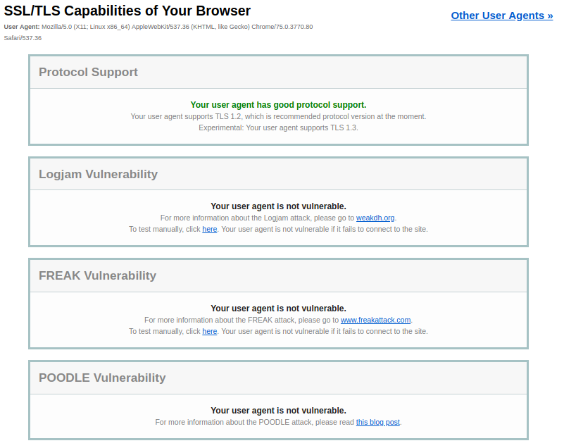

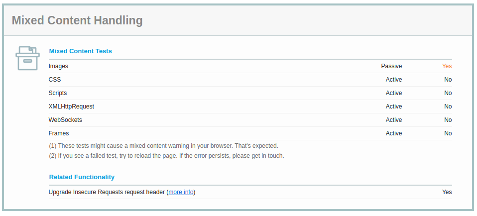

b.

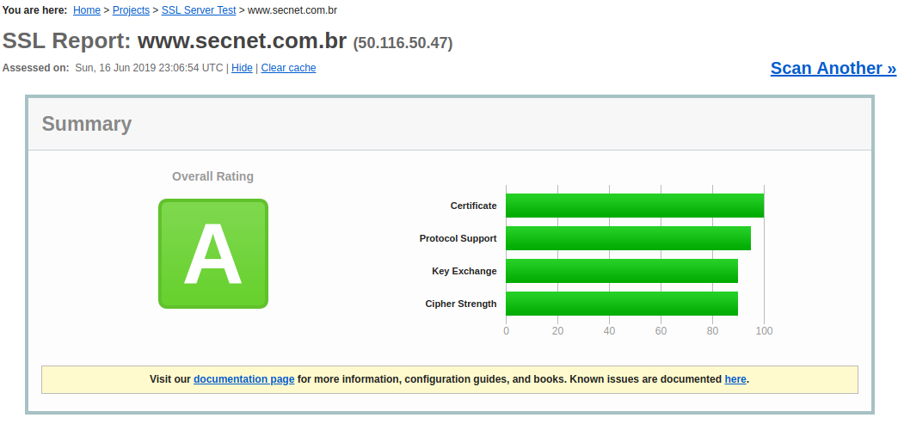

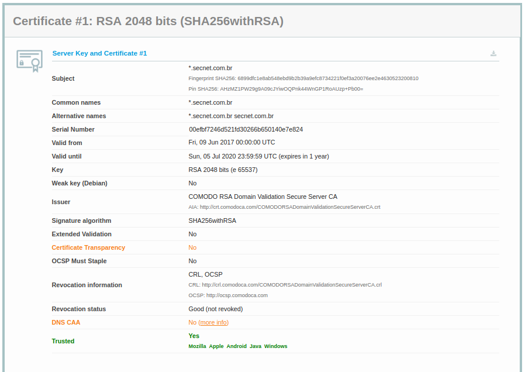

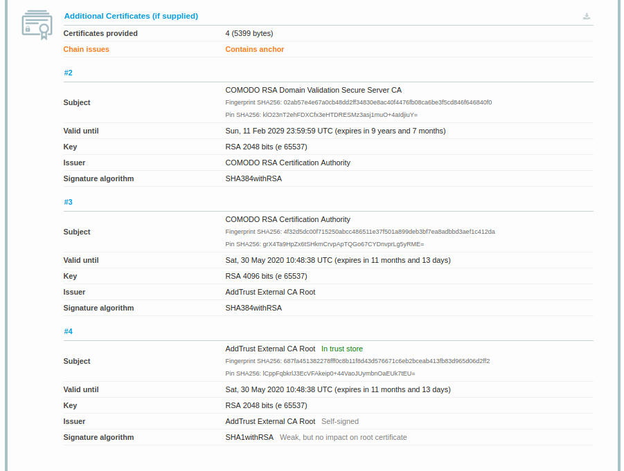

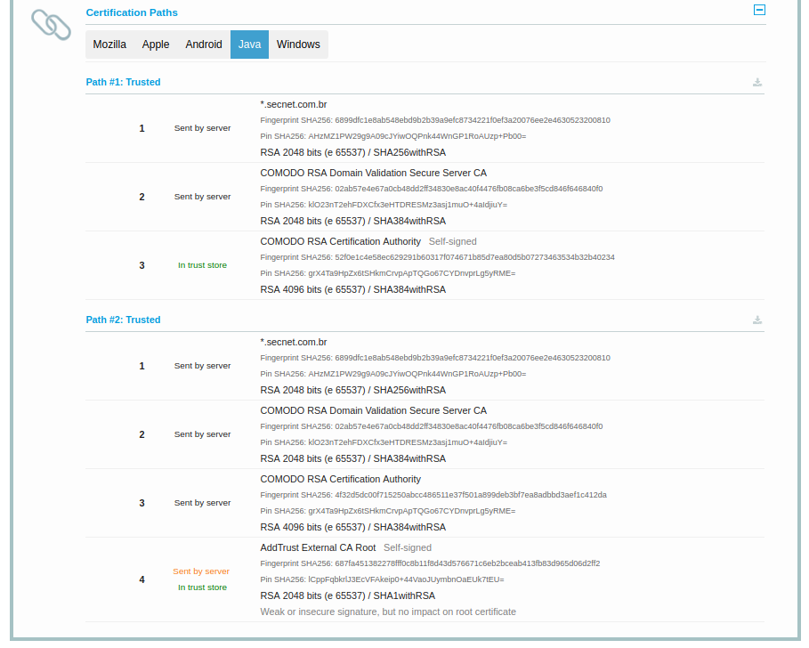

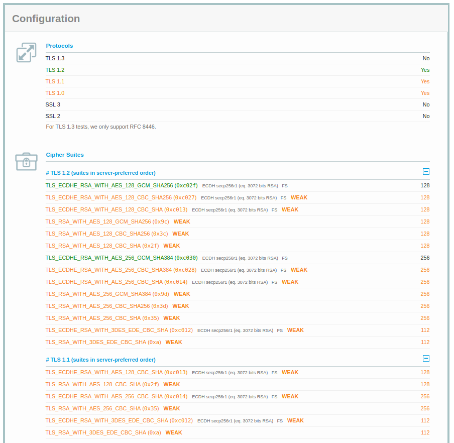

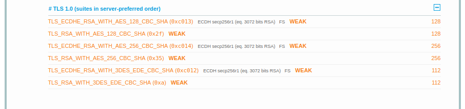

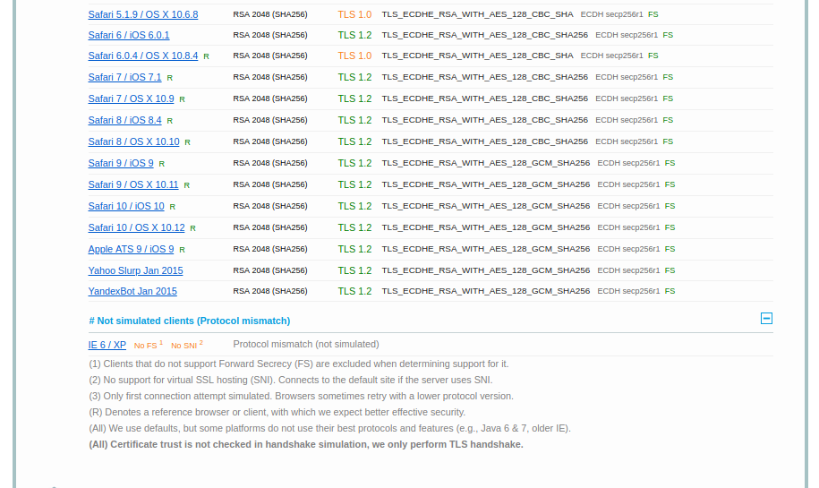

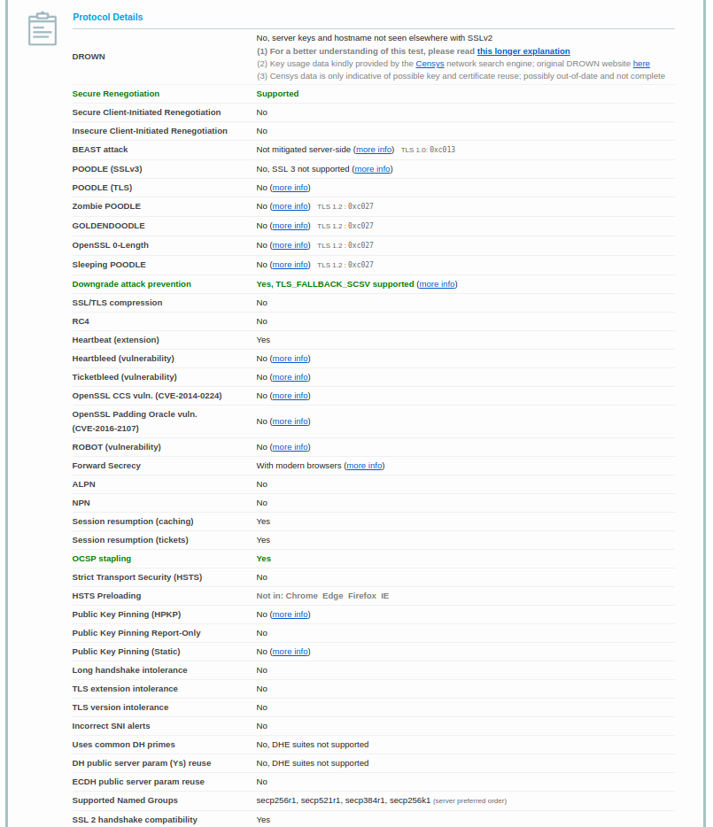

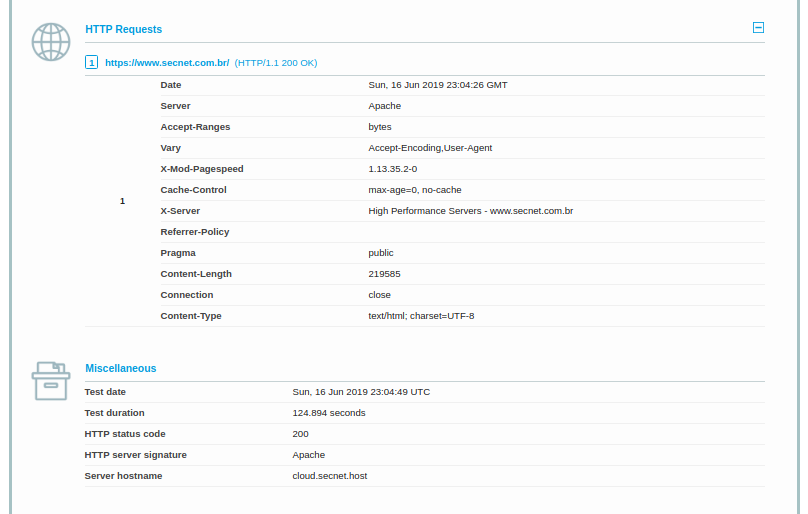

### 2. Leia  as  recomendações  da  página https://github.com/ssllabs/research/wiki/SSL-and-TLS-Deployment-Best-Practicese faça um pequeno resumo das seções 1 e 2 dessas recomendações.

**Respostas** 

1. Chave privada e certificado

O TLS começa com a identificação criptográfica do servidor. Para isso, é usado uma chave privada forte afim de evitar ataques de falsificação de identidade. Para garantir a segurança, há algumas dicas como:

- Use chaves particulares de 2048 bits
 Para grande parte dos sites, chaves RSA de 2048 já são o suficiente.

- Proteger Chaves Privadas
Restringindo o acesso, gerando chaves com entropia suficiente.

- Garantir cobertura suficiente de Hostname
É uma forma de garantir que todas as rotas estão acessíveis e evitar avisos de certificados inválidos.

- Obter certificados de uma CA confiável
Isso é, escolher uma Autoridade de Certificação (CA) que seja confiável e séria. Para escolher uma CA, deve-se levar em consideração:
  - **Postura de segurança:** uma opção é examinar seu histórico de segurança.

  - **As CAs com foco nos negócios:** cujas atividades constituem uma parte substancial de seus negócios, têm tudo a perder se algo der errado

  - **Serviços oferecidos:** No mínimo, sua AC selecionada deve fornecer suporte para os métodos de revogação da Lista de Revogação de Certificados (CRL) e do Protocolo de Status de Certificados Online (OCSP), com disponibilidade e desempenho de rede sólidos. 

  - **Opções de gerenciamento de certificados** se for necessário operar um grande número de certificados e operar em um ambiente complexo, escolha uma autoridade de certificação que ofereça boas ferramentas para gerenciá-los.

  - **Suporte** é uma tranquilidade ter um bom suporte.

- Use Algoritmos de Assinatura de Certificado Forte
A segurança do certificado depende (1) da força da chave privada que foi usada para assinar o certificado e (2) da força da função de hash usada na assinatura.

2. Configuração

É uma garantia que as credenciais sejam apresentadas corretamente aos visitantes do site. Há uma série de medidas para ser levado em conta:
  - Use cadeias de certificado completas

  - **Use protocolos seguros:** Na maioria das implantações, o certificado do servidor sozinho é insuficiente; Dois ou mais certificados são necessários para construir uma cadeia completa de confiança.

  - **Use Conjuntos de Codificação Segura** Existem cinco protocolos na família SSL / TLS: SSL v2, SSL v3, TLS v1.0, TLS v1.1 e TLS v1.2:
    - O SSL v2 é inseguro e não deve ser usado. 
    - O SSL v3 é inseguro quando usado com HTTP (o ataque POODLE).
    - O TLS v1.0 também é um protocolo legado que não deve ser usado.
    - O TLS v1.1 e v1.2 são ambos sem problemas de segurança conhecidos
    - O TLS v1.2 deve ser seu protocolo principal porque é a única versão que oferece criptografia autenticada moderna

  - **Use Conjuntos de Codificação Segura:** Em SSL e TLS, os conjuntos de criptografia definem como a comunicação segura ocorre. Eles são compostos de diferentes blocos de construção com a idéia de alcançar a segurança através da diversidade. Se um dos blocos de construção for fraco ou inseguro, é possível mudar para outro.

  - **Selecione as melhores suítes de codificação:** Ter servidores selecionando ativamente o melhor conjunto de criptografia disponível é fundamental para obter a melhor segurança.

  - **Use o sigilo antecipado:** O sigilo de encaminhamento (às vezes também chamado de sigilo de encaminhamento perfeito) é um recurso de protocolo que permite conversas seguras que não dependem da chave privada do servidor.

  - **Use troca de chaves forte:** Para a troca de chaves, os sites públicos normalmente podem escolher entre a troca de chaves Diffie-Hellman (DHE) efêmera clássica e sua variante de curva elíptica, ECDHE.

  - **Mitigar Problemas Conhecidos:**Nada é perfeitamente seguro, e é por isso que é uma boa prática ficar de olho no que acontece na segurança. Aplique prontamente correções de fornecedores se e quando elas estiverem disponíveis; caso contrário, confie em soluções alternativas para mitigação.

### 3. Explique de forma geral as quatro fases do handshake de acordo com as páginas do livro do Stallings 386, 387, 388 e 389 (o pdf do capítulo está anexado junto na tarefa).

**Respostas** 

1. Estabelecer capacidades de segurança
É a fase que inicia a comunicação. O cliente envia mensagem contendo alguns parâmetros:
  - versão do SSL
  - ID da sessão
  - Conjunto de cifras (cipherSuite) - é uma lista contendo algoritmo de troca de chave. Por exemplo, RSA, Diffie-Hellman, Diffie-Hellman anônimo Fortezza
  - Método de compactação(compression method) - é uma lista dos métodos de compactação que o cliente admite
Em seguida, o cliente aguarda a resposta do servidor.

2. Autenticação de servidor e troca de chaves
Nesta etapa, o servidor encaminha seus certificados, se necessãrio autenticar. A menssagem de certificado é exigida para qualquer troca de chaves que tenham sido acordadas, exceto se for Diffie-Hellman anônimo. A mensagem final desta fase é sempre exigida, é uma mensagem `server_done` enviada pelo servidor para indicar o final da resposta dele. Em seguida, o servidor aguardará uma resposta do cliente

3. Autenticação do cliente e troca de chaves
Quando o cliente recebe uma mensagem `server_done` ele verifica se o certificado é válido e se os parâmetros `server_hello` são aceitáveis. Se tudo ok, o cliente responde seja com uma mensagem `certificate` ou `no_certificate`. Na sequência, é recebido uma mensagem `client_key_exchange` contendo asgum conjunto de cifras:
  - RSA
  - Diffie-Hellman anônimo ou efêmero
  - Diffie-Hellman fixo
  - Fortezza
No fim desta fase, o cliente pode enviar uma mensagem `certificate_verify` para oferecer uma cerificação explítica de um certificado. Contudo, essa mensagem só é enviada após qualquer certificado que tenha capacidade de assinatura, ou seja qualquer certificado menos Diffie-Hellman fixo

4. Término
Na última etapa, o cliente envia uma mensagem `change_cipher_spec`. Cabe notar que essa mensagem não é considerada parte do protocolo de estabelecimento de sessão mas sim enviada usando o protocoloo de mudança de especificação de cifra. Alem da mensagem anterior, o cliente encaminha a mensagem `finished_message` sob os novos algoritmos, chaves e segredos. 
Em resposta, o servidor envia sua mensagem `change_cipher_spec`, transfere o CipherSpec pendente para o atual e envia sua `fineshed_message`. A partir daqui, o cliente e servidor podem trocar dados na camada de aplicação.

### 4. Coleta de um tráfego de handshake TLS
### Você deve capturar um handshake do TLS no Wireshark: ative a captura de pacotes no Wireshark, abra a conexão com um site que usa HTTPS e capture o tráfego. Depois de estabelecer a conexão segura, pare a  captura,  salve  a  capture  com  seu nome  (para  entregar  no  moodle  o  arquivo).  Comente um pouco o handshake do seu tráfego.

**Respostas** 

### 5. Compare o  handshakedos  protocolos  TLS  v1.2  e  TLS  v1.3  lendo  o  material  dos  seguintes  sitese observando as figuras. Tente responder de forma resumida, como feito na questão 3.•https://www.cloudflare.com/learning-resources/tls-1-3/•https://blog.cloudflare.com/rfc-8446-aka-tls-1-3/•RFC TLS 1.3: https://tools.ietf.org/html/rfc8446(seção2)•RFC TLS 1.2: https://tools.ietf.org/html/rfc5246(seção7.3)

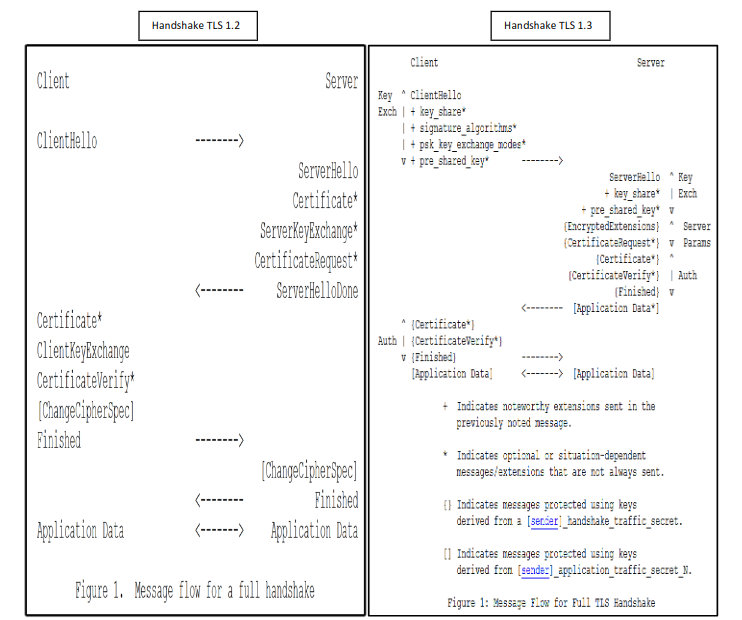

Você recebeu dois arquivos em anexo–gmail12 e facebook13. Esses arquivos contêmtráfegos de handshake estabelecidos com o gmail e com o facebook. Você irá analisar o handshake do TLS 1.2 no tráfego do gmail e  o  handshake  do  TLS  1.3 no  tráfego  do  facebook.A  análise  do  handshake  será  feita  nas  questões que seguem.

**Respostas** 

## Parte 02: TLS 1.2: abra o arquivo gmail12