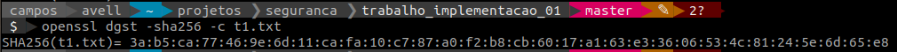

# Tarefa Prática 
OpenSSL + Exercícios de criptografia simétrica, hash, MAC, PBKDF e Criptografia Autenticada em Java

#### Alunos
Bruno Aurélio Rôzza de Moura Campos (14104255)
Caio Cargnin Cardoso (09138003)

#### Matéria
- Segurança da informação e sistemas - INE5680

## 1 parte - OpenSSL usando a Kali Linux

#### CIFRAR E DECIFRAR

1. **(ENTREGAR) Cifrar o arquivo `t1.txt` com o algoritmo AES no modo CTR. Ver modos de cifragem usando: openssl enc -help**
**Use o comando:**
```bash
openssl enc -aes-128-ctr –in t1.txt –out t1.aes -p
```


 - **a) Qual chave foi usada para cifrar o arquivo?**
key=4CDF109430C8BB4E0DFD4B264C4291A8
 
 - **b) Qual IV foi usado?**
iv =FA458B36C3A0C9B8CEE0B7F7310FBAF5

 - **c) Como foram gerados a chave e o IV?**
 Tanto a chave quanto o IV foram gerados a partir da senha inserida (root). Um password é exigido como primeiro passo após executar o comando. Como ultimo argumento do comando foi inserido `-p` para exibir o iv e key.

 - **d) Onde ficam guardados a chave e o IV?**
A key e o IV são persistidos no arquivo `t1.aes` criado a partir do comando `-out t1.aes`

2. **(ENTREGAR) Agora, decifre o arquivo t1.aes.**
Use o comando: 
```bash
openssl enc -aes-128-ctr -d -in t1.aes -p
```
O argumento `–d` significa “decifrar”.


#### HASH e MAC

3. **(ENTREGAR) Crie o arquivo t1.txt no gedit e escreva algum conteúdo dentro do arquivo. Para gerar o hash deste arquivo usando o algoritmo sha256, pode ser usado o seguinte comando:**
```bash
openssl dgst -sha256 t1.txt
```
**Execute os seguintes comandos e coloque a saída obtida (screenshot) de cada um deles:**
- **a. Obtenha a saída do comando:**
```bash
openssl dgst -sha256 -c t1.txt
```



- **b. Modifique o conteúdo do arquivo t1.txt. Agora, recalcule o valor do hash com o mesmo comando do item a. O valor obtido é igual ao valor do item a ou é diferente? Explique.**


Os valores gerados, com o parâmetro (`-dgst` _Message Digest Calculation_) são diferentes porque a função executa a partir de entradas diferentes.

- **c. Encontre um arquivo em alguma página web que tenha o valor do hash SHA-256 listado na página (Sugestão de página: http://httpd.apache.org/download.cgi#apache24) . Baixe o arquivo e recalcule o valor do SHA-256 com o openssl para conferir se o valor calculado é igual ao listado na página web. Mostre a tela da execução desse comando e indique o site usado.**


<br/>
<br/>
Valores igual:

<br/>
<br/>

4. **(ENTREGAR) Para gerar o MAC do arquivo use o comando abaixo, mostrando a tela de execução do comando. Explique os parâmetros usados no comando. Use o help e digite:**
```bash
openssl dgst –help
```
- a) 
```bash
openssl dgst -sha256 -mac HMAC -macopt hexkey:aabbcc t1.txt
```


- `sha256` usa o algoritmo sha-256
- `mac` cria o MAC
- `HMAC` (Hash-based Authentication Message Code) criar MAC com hash com chave
- `macopt hexkey:aabbcc` especifica uma a chave como argumento na forma hexadecimal, 2 dígithexadecimais por byte.

---

## 2 parte – Criptografia em Java

1. **(ENTREGAR) (Dupla) Abra o projeto2CodigoLivro e teste o seu funcionamento. Responda:**

- **1.1. Qual algoritmo é usado no código? Em qual modo?**
- **1.2. Explique o que faz o método generateKey da classe https://docs.oracle.com/javase/7/docs/api/javax/crypto/KeyGenerator.html.
KeyGenerator**
- **1.3. Explique como são usados os métodos init, update e doFinal para cifrar e para decifrar os dados nesse código. Leia a documentação e entenda bem o funcionamento desses métodos.**


2. **(ENTREGAR) (Dupla) Nesse projeto você irá programar dois sistemas de decifragem, um usando o AES em modo CBC e outro usando o AES no modo contador (counter mode – CTR). Em ambos os casos um IV de 16 bytes é escolhido de forma aleatória e está colocado no início do texto cifrado (precede o texto cifrado). Para o modo CBC use o esquema de padding PKCS5. Para o modo CTR use NoPadding.
Inicialmente iremos testar apenas a função de decifragem. Use o projeto3Aes para auxiliar a responder as questões. Nas questões seguintes você recebe uma chave AES e um texto cifrado (ambos codificados em hexa) e o seu objetivo é recuperar o texto plano/texto decifrado. A resposta de cada questão é o texto decifrado (frase em português).**

- **a)
• Chave CBC: c38a0d7bdd11e031c24e4895913393f9
• Texto cifrado em modo CBC (IV+texto cifrado):
b90d84b82b283d5f783b9721f5f8bd1fb170b4319815f1a4fdbaff6f052f6e58a06d0200f28b1d333d8e3
f11fcafef750122226c1bcea8d69416f5a15e4901b3c2fb5c33507139fe88f18c72fb0c435d
Resposta-texto decifrado:**

- **b)
• Chave CTR: abd95641ecb005d475496cd0bda4555f
• Texto cifrado em modo CTR (IV+texto cifrado):
7182eb9d1fd3d9ed3ae1594b3cd3b02bf4667cd27c5e0a01dc2e66f53480e5fa249269e1bd17e7e06682
4dcab22be4ccff41480a139eae1d390e1dd78548d7bb82841d88ae50fd4ea52727

Resposta-texto decifrado:**

3. **No código testeModifica, faça:
 - 3.1. Explique o funcionamento do exemplo;
 - 3.2. Explique o significado da seguinte linha de código:**
 ```java
 cipherText[11] ^= '0' ^ '9';
 ```

4. **No código testeHASH, faça:
 - **4.1. Explique como o hash sem chave é usado nesse exemplo;**
 - **4.2. O que significa o valor “false” na verificação do hash?**

5. **Sobre hash de senhas, leia o material disponível do site https://crackstation.net/hashing-security.htm e escreva um resumo sobre o que é “certo” e o que é “errado” ao criar um arquivo com hashes de senhas. Projete uma ideia de formato seguro de arquivo de senhas fundamentado/baseado nas boas práticas descritas no material. Você deve criar o seu formato e deve descrever razões das escolhas feitas para o seu formato.**

6. **(ENTREGAR) No código testeModificaETrocaHash, faça:**
 - **6.1. Explique como o hash sem chave é usado nesse exemplo;**
 - **6.2. Explique a etapa de troca do hash do código abaixo.**
```java
// etapa de troca do hash
byte[] originalHash = hash.digest(Utils.toByteArray(input));
byte[] tamperedHash = hash.digest(Utils.toByteArray(
"Transferir 9000100 para Conta Corrente 1234-5678"));
for (int i = ctLength - hash.getDigestLength(),
j = 0; i != ctLength;
i++, j++)
{
cipherText[i] ^= originalHash[j] ^ tamperedHash[j];
}
```

7. No código testeHMAC, faça:

 - 7.1. Explique como o hash com chave/MAC (HMAC) é usado nesse exemplo;

 - 7.2. Explique o que acontece no código abaixo:

```java
hMac.init(hMacKey);
hMac.update(Utils.toByteArray(input));

ctLength += cipher.doFinal(hMac.doFinal(), cipherText, ctLength), 0, hMac.getMacLength();
```

7.3. Explique o que acontece no código abaixo:
```java
hMac.init(hMacKey);
hMac.update(plainText, 0, messageLength);
byte[] messageHash = new byte[hMac.getMacLength()];
System.arraycopy(plainText, messageLength, messageHash,
0, messageHash.length);
System.out.println("Texto decifrado: " +
Utils.toString(plainText, messageLength));
System.out.println("Verificado o Mac: " +
MessageDigest.isEqual(hMac.doFinal(), messageHash));
```

8. (ENTREGAR) No código AES-CriptoAutenticada, faça:
Obs: para funcionar este código você deve descompactar o arquivo jce_policy-8 que está dentro do diretório deste projeto. LEIA o README para saber para onde você deve copiar os arquivos descompactados. Só fazendo isso você conseguirá criar o AES com tamanhos de chave maiores. Se você tiver o JAVA 7, você deve baixar o arquivo na Internet: procure por Java Cryptography Extension (JCE) Unlimited Strength Jurisdiction Policy Files 7.

 - 8.1. Explique o funcionamento do método gcmTestWithGCMBlockCipherBC;

 - 8.2. Como as tags (MACs) foram usadas para identificar a modificação no texto cifrado?

 - 8.3. A detecção da modificação foi feita de forma manual ou automática no código? Explique.

9. **Compare** os códigos do testeHMAC e AES-CriptoAutenticada:

- a) qual o modo e algoritmo de cifragem usado em cada código? 
- b) qual a diferença no funcionamento destes dois códigos?

10. Testar e explicar o código no diretório testePBKDF2.
 Responda também: o que faz o método generateDerivedKey?